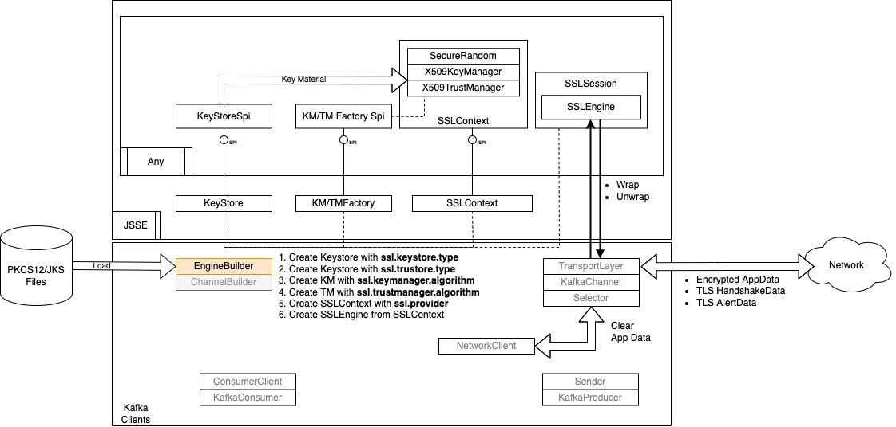
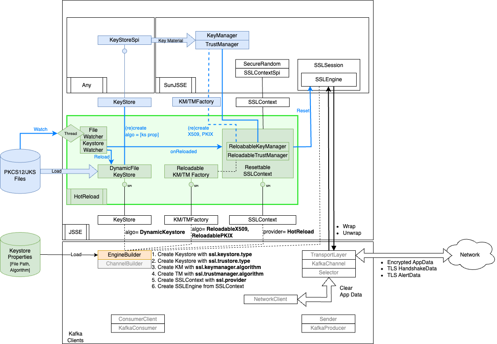

# HotReload Provider

[JSSE Provider](https://docs.oracle.com/en/java/javase/11/security/java-secure-socket-extension-jsse-reference-guide.html) supporting hot reload of certificates. 
Designed specifically for projects using [kafka-clients library](https://mvnrepository.com/artifact/org.apache.kafka/kafka-clients) 
or other libraries with deeply embedded NIO Network stack.  


## Quick Start

Just use the **devcontainer** with your favourite IDE or GitHub Codespace

Head to [vdr.jsse.demo](./src/test/java/vdr/jsse/demo) package for several runnable examples. 


## Build

### Prerequisites

OpenSSL, Java8

If you have `asdf` with java plugin, install the appropriate JVM with

```shell
asdf install
```

### Building

You need to generate some certificate, run

```shell
cd ./src/test/resources; ./create-certs.sh; cd -
```

After that, run maven normally:

````shell
./mvnw clean install
````

## General User Guide

HotReload Provider is used like a regular JSSE Provider. It should be loaded in the JVM and then is used indirectly as a SPI for the Keystore, Trust/KeyManager and SSLContext by any library using those components. Usually this is done via configuration but is entirely dependent on the library.

It is recommended that HotReload provider is loaded statically by adding it to the JVM `java.security` properties file.

For demo point of view, head to [vdr.jsse.demo](./src/test/java/vdr/jsse/demo) package. The executable in that package will load and run various demo scenario demonstrating the provider working. 

The provider provide 2 main functionality:

1. A DynamicKeyStore and corresponding KeyManager and TrustManager. 
   Those will detect a keystore change and reload them, making them immediately available to any new connection either socket or NIO. 

   * The keystore supports PKCS12 and JKS
   * The keymanager supports reloadable `ReloadableX509` and `ReloadablePKIX` algorithms wrapping respectively `SunX509` (**java default**) and `NewSunX509`
   * The trustmanager supports reloadable``ReloadableSimple` and `ReloadablePKIX` algorithms wrapping respectively `SunX509` and `PKIX`(**java default**)

2. (Advanced) A Resettable implementation of SSLContext for immediate reload of current and future connections.

   * Use with caution on NIO ssl network stack that recover automatically from network errors. 

   * Support all the Java default contexts, in particular TLS 1.2 and 1.3

   * In TLS 1.2, it will trigger a renotiation of key

   * In TLS 1.3, it will close the engine forcing the calling code to start a new connection

     

### Load the provider

The provider jar can be built or downloaded from a repository (maven, GitHub, ...)

#### Static loading [Recommended]

Make sure the **jar** is available on the **application classloader**. This means either on the java command classpath argument (`java -cp`) or in the JVM `lib-ext` folder. 

If it is included in a children classloader such as SpringBoot Executable Jar Classloader or WebApp deployment, it cannot be loaded statistically and must be loaded programmatically.

In particular Spring Boot single jar do not allow static loading. If the provider is loaded through Maven dependencies, a copy step in the build is necessary to separate the jar from the application.   

Add a security provider entry in `$JAVA_HOME/conf/security/java.security`

Eg:

```properties
#
# List of providers and their preference orders (see above):
#
security.provider.1=SUN
security.provider.2=SunRsaSign
security.provider.3=SunEC
security.provider.4=SunJSSE
security.provider.5=SunJCE
security.provider.6=SunJGSS
security.provider.7=SunSASL
security.provider.8=XMLDSig
security.provider.9=SunPCSC
security.provider.10=JdkLDAP
security.provider.11=JdkSASL
security.provider.12=Apple
security.provider.13=SunPKCS11
# Strictly incremental sequence. 
# Different environments will have different number of provider by default.
# Make sure the provider is at the exact last index with no gap. 
# However the provider can be defined anywhere in the file
security.provider.14=vdr.jsse.HotReloadProvider
```

#### Static loading using command line argument

If the JVM `java.security` file is not editable the provider can be loaded in a specific instance only. 

To avoid such issue, a provider can be declared in an add-on file that is declared in the system property `java.security.properties`

eg: 

```bash
java -Djava.security.properties=/full/path/to/the/additional/extra-java.security ...
```

with `extra-java.security` containing:

```properties
# Same rule about strict incremental sequence. 
# 14 needs to be the last index, no gap.
security.provider.14=vdr.jsse.HotReloadProvider
```

**Note:** Like other JSSE Providers, HotReload provider will not consume resource or have side-effect if it is not explicitly used. That means it is safe to configure globally for a JVM even if used by multiple applications. There are exceptions, like for example HotReload provider itself, as the unit need to load and unload the provider dynamically which is not possible if the provider has been statically loaded. 

#### Dynamic Loading

Although not recommended, this is the only option if you do not have access to either the Application ClassLoader or the ext-lib folder.

A provider can be loaded dynamically in the code. This should be done as early as possible in your application, ideally in the `main()` method if present. 

eg. Before calling `SpringApplication.run(...)` in a SpringBoot app.

```java
@SpringBootApplication
public class App {
    public static void main(String[] args) {
        HotReloadProvider.enableLast();
        SpringApplication.run(App.class, args);
    }
}
```

### 2. Configure Provider

Provider does not require configuration and provides reasonable defaults.

The following system properties can be set to changed the default behaviour:

```
HotReload.EventBufferWindowMs: >= 0 long, default 1000 
                                 Slow file system and/or slow keystore creation can lead 
                                 a file to be loaded before it has been fully updated.
                                 This setting control the time in ms the keystore will
                                 wait until it reacts on a file change event. 
                                 It will buffer further event in that time window.  
                                 Use 0 to disable.
```

### Enable the Provider

Once the provider is loaded you have access to the context, key/trust managers, and keystore.

#### Dynamic Keystore

The trick allowing the dynamic keystore to detect file changes is that it is not created from the binary content of a keystore but through an intermediary properties files. The properties file points to the keystore to monitor.

You can optionally specify `password.location` and the `keypass.location` to point to a file that has the keystore password and keymanager password to support password reloading.

Caution: password stored in file are trimmed.

Eg: `keystore.properties`


```properties
location=/path/to/keystore.jks
keystore.algorithm=JKS
password.location=/path/to/password.creds
keypass.location=/path/to/keypass.creds
```

You can initialise a keystore of type `DynamicKeystore` with that file. 

example: see `SSLEngineSimpleDemo`

```java
KeyStore ks = KeyStore.getInstance("DynamicKeystore");
try (InputStream data = loadFile("/path/to/keystore.properties")) {
  ks.load(data, "not used".toCharArray());
}
```

Unfortunately Java default Key and Trust managers will cache the value returned by a keystore. HotReload provider provides wrapper for the 4 most common Java default Key and Trust Managers:

* KeyManager `ReloadableX509` for `SunX509` (**java default**) 
* KeyManager `ReloadablePKIX` for `NewSunX509`
* TrustManager `ReloadablePKIX` for `PKIX` (**java default**) 
* TrustManager `ReloadableSimple` for `SunX509`

You would know if you need to use something else than the default. 

```java
KeyManagerFactory kmf = KeyManagerFactory.getInstance("ReloadableX509");
kmf.init(ks, "not used".toCharArray());

TrustManagerFactory tmf = TrustManagerFactory.getInstance("ReloadablePKIX");
tmf.init(ts);
```

From them on, certficate will be reloaded on average half a second after they have been changed on disk (hardware dependent) and new connections will use the new certificates. 

#### Resettable Context

If you use both a dynamic keystore and reloadable key/trust manager, then you can optionally use a resettable context so that certificate change are immediately propagated to existing connection. 

Just use the context from HotReload provider rather than the default provider.

eg:

```java
serverContext = SSLContext.getInstance("TLSv1.2", "HotReload");
serverContext.init(kmf.getKeyManagers(), tmf.getTrustManagers(), null);
```


## Kafka User Guide

HotReload has been designed to work with Kafka Client library 2.4+ 

Here is a snapshot of how Kafka Client interfaces with Java JSSE



As we can see, because the Keystore is loaded by the EngineBuilder and Kafka doesn't monitor the certificate for changes, certificate won't be reloaded. 

When using the HotReload JSSE Provider, EngineBuilder load a property file pointing to the keystore rather than the keystore itself. Thanks to this indirection, DynamicKeystore is able to monitor the keystore file and reload it when needed. 

Unfortunately, default Trust and Key managers cache the result from the keystore meaning a new set of key and trust manager aware to reload is needed. 

The last element is the SSLContex. In practice Kafka keep its connection opened for as long as it can, meaning old certificate can still be used for a quite a while. To avoid that, a Resettable context will trigger renegotiation on TLS 1.2 connection and close TLS 1.3 one. Kafka Network Stack is very robust and will handle that transparently without even triggering a rebalance.  



* Green are the new components.

* Blue are the components recreated when the KeyStore file changes

* White is existing components, not recreated even when the KeyStore file changes.

Key features: 

1. Dynamic reload not affecting the transport side and therefore no performance impact outside the actual reload. 

2. Immediate effect. All Kafka SSL Connections are renegotiated upon reload. 

3. No code handling either keystore files, passwords or network data. Very small security attack surface.

   

### Configure HotReload in Kafka

Create the properties file that point to the keystore to monitor.

You can optionally specify `password.location` and the `keypass.location` to point to a file that has the keystore password and keymanager password to support password reloading.

Caution: password stored in file are trimmed.

Eg: `keystore.properties`


```properties
location=/path/to/keystore.jks
keystore.algorithm=JKS
password.location=/path/to/password.creds
keypass.location=/path/to/keypass.creds
```

Configure Kafka clients to use that file as a `DynamicKeystore`

Additionally configure Kafka clients to use `HotReload` provider for SSL and `ReloadableX509` as KeyManager.

eg: with Spring Kafka this looks like:

```yaml
spring:
  kafka:
    properties:
      ssl.provider: HotReload
      ssl.keymanager.algorithm: ReloadableX509
      ssl.trustmanager.algorithm: ReloadablePKIX
    security:
      protocol: SSL
    ssl:
      trust-store-location: truststore.properties
      trust-store-password: not used
      key-store-location: keystore.properties
      key-store-password: not used
      key-password: not used
      key-store-type: DynamicKeystore
```

Note that passwords are ignored if a `password.location` or `keypass.location` are provided in the keystore properties. Otherwise, they would be the password of the underlying keystore.

With regular client properties it looks like:

```properties
security.protocol=SSL
ssl.provider=HotReload
ssl.keymanager.algorithm=ReloadableX509
ssl.trustmanager.algorithm=ReloadablePKIX
ssl.truststore.location=keystore.properties
ssl.truststore.password=not used
ssl.truststore.type=EssKeystore
ssl.keystore.location=truststore.properties
ssl.keystore.password=not used
ssl.key.password=not used
ssl.keystore.type=DynamicKeystore
ssl.endpoint.identification.algorithm=
```


## Caveats

1. No SSLSocket reset support
2. There is a dirty trick to link a ReloadableKeyManager to a DynamicKeystore. 
   Since the KeyManager receives a Keystore rather than KeystoreSPI, we abuse the `Keystore#store` method to give enough information about the underlying SPI to match it to an instance of `FileWatcher`
